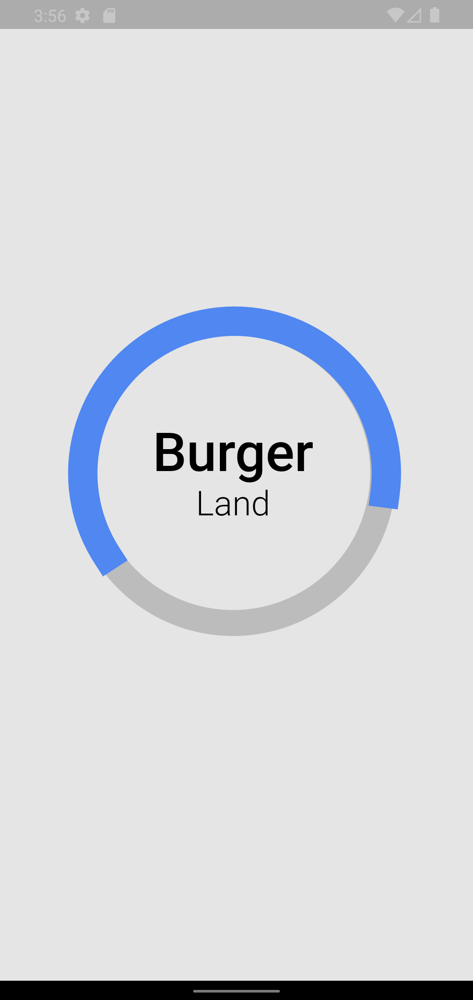
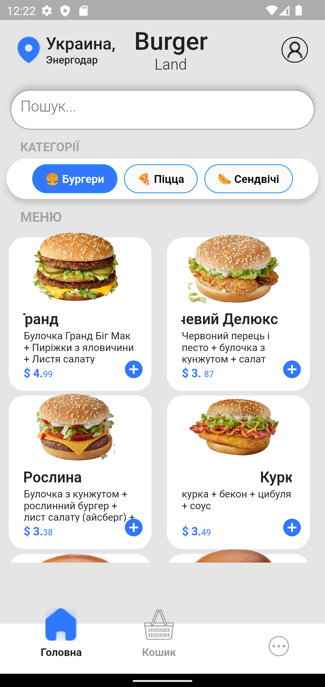
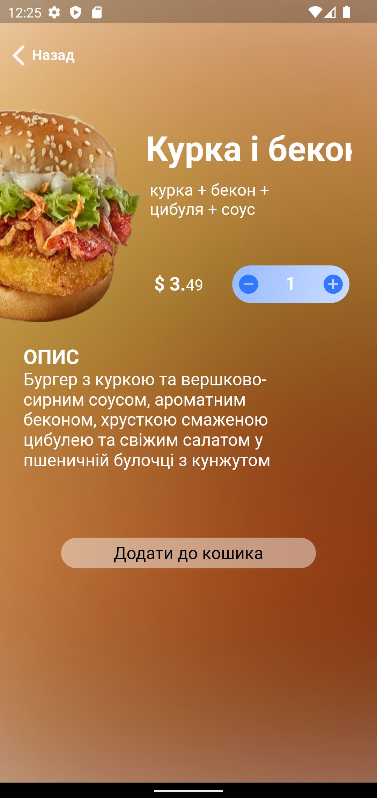
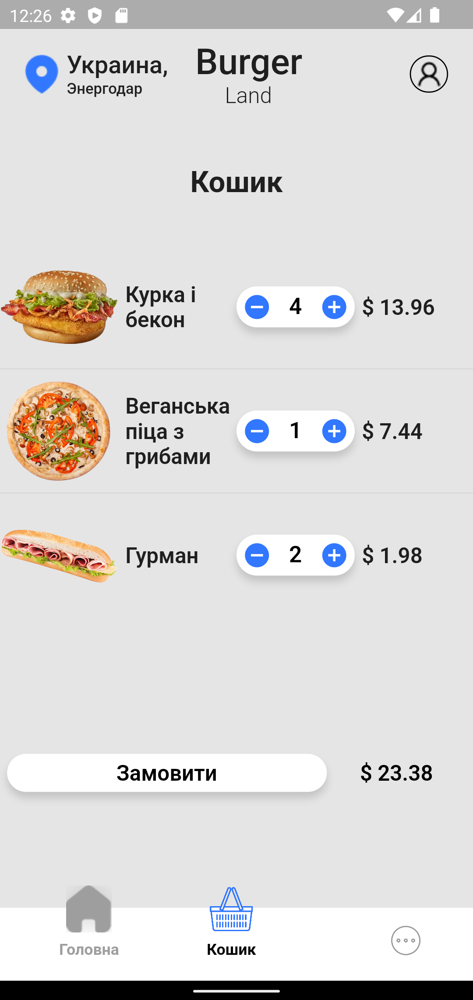
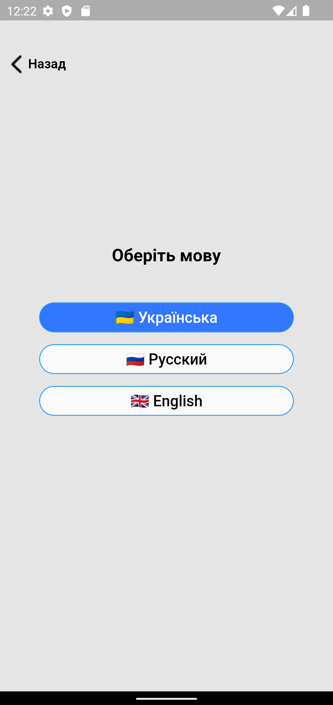

# Food Delivery Application

## Description

The application provides the user with an interactive list of different categories of food that he can order. It is possible to search by name, edit the order, authorize by e-mail and password for regular users, view detailed information about the dish, as well as change the interface language. The project implemented provider architecture, used firebase store and auth.

## How it looks

After launching the application, we get to the loading screen, which is shown to the user until the application communicates with the database.

After loading, the user gets to the main screen.

If you want to know more information about a dish, you can click on it and go to the details screen.

After adding the desired dishes to the basket, you can view them on the order screen.

The user can also select one of the three available languages on the language selection screen.
